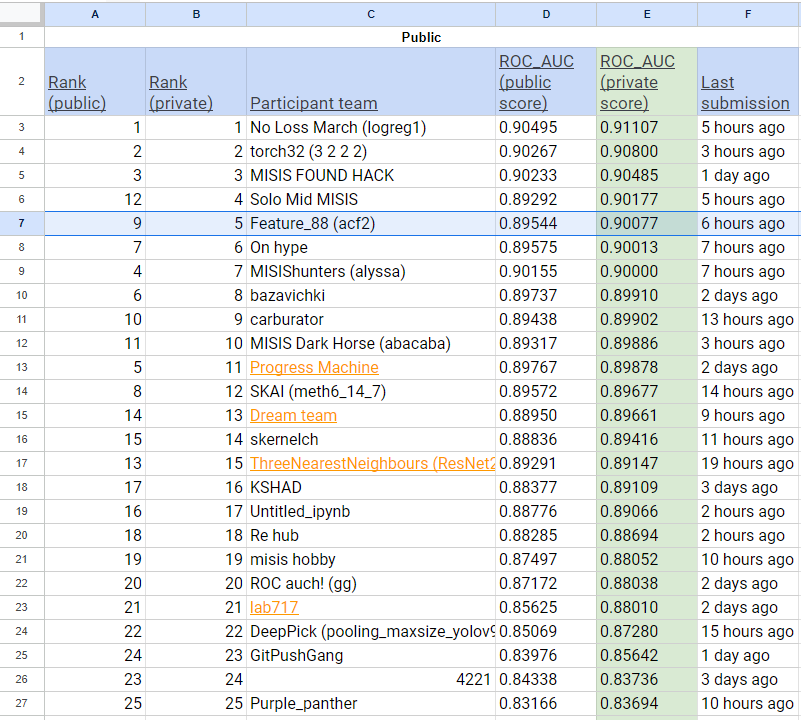

# IT Purple Hack. Team Feature_88
Конкурсное решение хакатона IT Purple Hack. Кейс: Решение бизнес-задач, связанных с CLTV Альфа банк.
(Многоклассовая классификация)

Само решение в ноутбуке [it_purple_hack_alpha_ctb_final.ipynb](https://github.com/andrecpc/it-purple-hack-team-feature-88/blob/main/it_purple_hack_alpha_ctb_final.ipynb).
Для запуска необходимо наличие GPU.

Лучший скор на публичной части лидерборда 0.89544. Достигается за счет предикта с помощью catboost; файл submission_ctb.csv.

Суть решения:
 - Обучаем первый классификатор (catboost) восстанавливать start_cluster и восстанавливаем отсутствующие значения в тесте.
 - Обучаем второй классификатор (catboost) предсказывать end_cluster и делаем предикт для теста.
 - Уже на этом этапе можно делать посылку на LB.

 - Обучаем другую модель классификации end_cluster -- Нейронная сеть на PyTorch и так же предсказываем end_cluster в тесте.
 - Усредняем предсказания нейронки и катбуста.

 Решение запускалось в [Colab](https://colab.research.google.com/drive/1nfYU9eckDmaV4wvuilXEsyQ8-evqk_3z?usp=sharing) и на [Kaggle](https://www.kaggle.com/pan4sf/it-purple-hack-alpha-ctb).

Скриншот публичного лидерборда на момент загрузки решения на гитхаб
 
